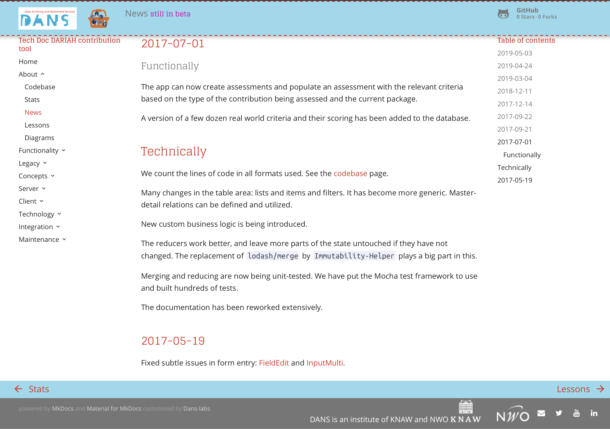

# DANS MkDocs theme"

## Write optimal documentation in DANS style

"Material" is a theme for [MkDocs][1], an excellent static site generator geared
towards project documentation. It is built using Google's [Material Design][2]
guidelines.
This theme has been implemented for MkDocs by [Martin Donath][3] in such a way that it can
be tweaked and rebuilt and redistributed.
That is exactly what I have done to create a DANS theme for MkDocs documentation.
It can still be tweaked further, but I have made it less customizable, 
because, after all, it is a specialization for a specific organization.

Most of the documentation has been written by Martin Donath, but I have simplified
and adapted his material for the purposes at hand.

See also the [authors-notes](authors-notes.md).

[](images/danstheme.png)

  [1]: https://www.mkdocs.org
  [2]: https://material.io/guidelines/material-design/
  [3]: https://squidfunk.github.io/mkdocs-material/

## Prerequisites

### System

Python 3.4 or higher.

``` sh
pip3 install mkdocs
pip3 install pygments
pip3 install pymdown-extensions
pip3 install pyyaml
```

Basic familiarity with the
[MkDocs](https://www.mkdocs.org)
generator of static pages from Markdown.

### Project

Your project has a top-level folder named `docs`,
containing a family of Markdown, HTML, and image files.

At the top-level of your project, *next to* `docs`, there is a file
`mkdocs.yml` with settings for mkdocs and settings for this theme.

```
~/github/docs/index.md
        |    / files and subdirectories
        /mkdocs.yml
```

You can use the
[mkdocs.yml](https://github.com/Dans-labs/mkdocs-dans/blob/master/mkdocs.yml)
of the documentation you are reading now as an example.

## Quick start

The DANS theme is not available on PyPI.
In order to get it and use it, you have to clone its GitHub repo
to your own computer:


``` sh
cd ~/github/Dans-labs
git clone https://github.com/Dans-labs/mkdocs-dans
```

??? info "~/github"
    The place where your cloned repository resides on your
    own computer is immaterial. `~/github` is just an example.

From there, you build the theme as follows:

``` sh
cd mkdocs-dans
python3 build.py pack
```

This will install the theme locally on your computer in the place where
Python modules live.

Now, if you want to use this theme in a project,
put this in the `mkdocs.yml` of that project:

``` yaml
theme:
  name: dans
```

You can tweak the way the theme behaves by means of a few parameters under `theme`,
e.g. as follows:

``` yaml
theme:
  name: dans
  logo: 'images/test.png'
  favicon: 'images/test.png'
  development: true
  development_label: under development
  production_link: https://dans.knaw.nl/en
  client:
    name: Data Archiving and Networked Services (DANS)
    url: 'https://dans.knaw.nl/en'
    logo: assets/images/DANS.gif

  feature:
    tabs: false

  disclaimer: false
```

The paths for `logo` and `favicon` are relative to the `docs` directory.

The `development` flag produces a layout that reminds the user that your documentation
is still `under develoment` (if you want to put that differently, use
`development_label`).
In that case, you can point to the production docs by means of
`production_link`.

The `client` setting places the logo of the client for which the project is done
in the top bar. If the client is DANS, you do not have to pass this setting,
because the default values draw in the DANS logo.

If you have a large set of pages, you might want to put the first level of navigation
in a horizontal line of tabs.
For that, set

``` yaml
    tabs: true
```

If `disclaimer` is true (which is the default), the footer shows a message
that the docs have been produced as a product of a specific project, and that
the material may be subject to change.

You can suppress that message by 

``` yaml
    disclaimer: false
```

## Usage

MkDocs includes a development server, so you can review your changes as you go.
The development server can be started with the following command:

``` sh
mkdocs serve
```

Now you can point your browser to [http://localhost:8000][9] where the docs
will be served. From here on, you can start writing and editing your documentation.
Every time you save a documentation file, the docs will be reloaded.

  [9]: http://localhost:8000


You can also just build the docs without serving them:

``` sh
mkdocs build
```

And you can deploy the docs to the GitHub pages of the project's repository:

``` sh
mkdocs gh-deploy
```

## Writing Markdown

A number of very convenient Markdown extensions are enabled. 
Navigate to them via *Extensions*, e.g.
[Admonition](extensions/admonition.md).

## Tips

For optimal navigation, customize your
[navigation interface](https://www.mkdocs.org/#adding-pages)
by means of the `nav` variable in your `mkdocs.yml`.

If you have external links, consider abbreviating those links in your
`mkdocs.yaml`. 
Two advantages:

1.  if you use a link multiple times, you can just use the same short abbreviation
2.  easier to maintain the external links in your docs, should they become broken and
    in need for updates.

## Feedback

I have made some simplifications, and maybe I have not covered all aspects of the theme.
Maybe I have got the DANS styles wrong.

File an
[issue](https://github.com/Dans-labs/mkdocs-dans/issues)
or submit a 
[pull request](https://github.com/Dans-labs/mkdocs-dans/pulls)
if you have improvements.

## What to expect

* Responsive design and fluid layout for all kinds of screens and devices,
  designed to serve your project documentation in a user-friendly way in 37
  languages with optimal readability.

* Easily customizable favicon and logo;
  straight forward localization through theme extension;
  integrated GitHub.

* Well-designed search interface accessible through hotkeys (<kbd>F</kbd> or
  <kbd>S</kbd>), intelligent grouping of search results, search term
  highlighting and lazy loading.
