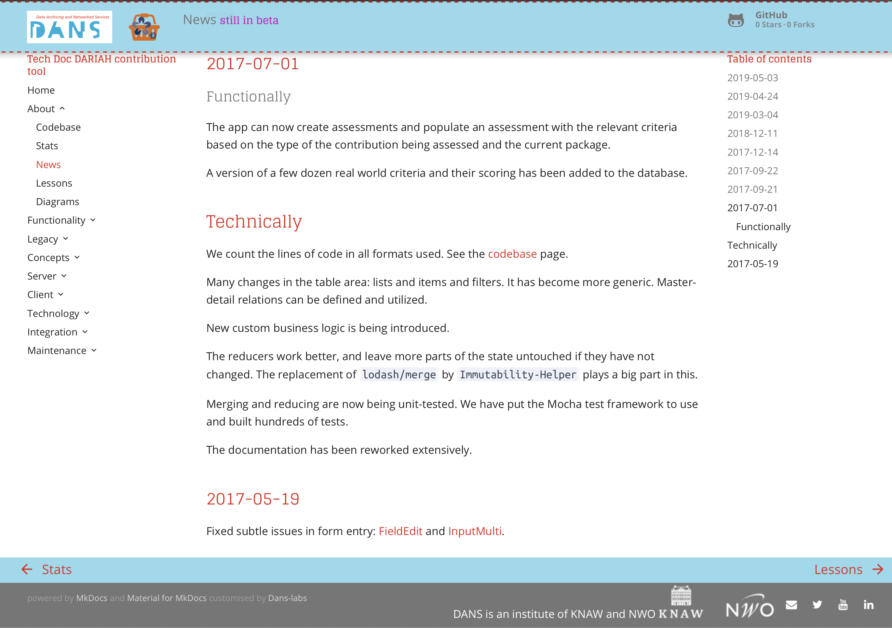

# DANS theme <small>for MkDocs</small> based on "Material"

## Create beautiful project documentation

Material is a theme for [MkDocs][1], an excellent static site generator geared
towards project documentation. It is built using Google's [Material Design][2]
guidelines.
This theme has been implemented for MkDocs by [Martin Donath][3] in such a way that it can
be tweaked and rebuilt and redistributed.
That is exactly what I have done to create a DANS theme for MkDocs documentation.


[](assets/images/material.png)

  [1]: https://www.mkdocs.org
  [2]: https://material.io/guidelines/material-design/
  [3]: https://squidfunk.github.io/mkdocs-material/

## Quick start

The DANS theme is not available on PyPi.
In order to get it and use it, you have to clone the github directory
to your own computer:


``` sh
git clone https://github.com/Dans-labs/mkdocs-dans
```

From there, you build the theme as follows:

``` sh
cd mkdocs-dans
python3 build.py make
```

This will install the theme locally on your computer in the place where
Python modules live.

Now, if you want to use this theme in a project,
put this in the `mkdocs.yml` of that project:

``` yaml
theme:
  name: dans
```

You can tweak the way the theme behaves by means of a few parameters under `theme`,
e.g. as follows:

``` yaml
theme:
  name: dans
  logo: 'images/test.png'
  favicon: 'images/test.png'
  development: true
  development_label: under development
  production_link: https://dans.knaw.nl/en
```

The `development` flag produces a layout that reminds the user that your documentation
is still `under develoment` (if you want to put that differently, use
`development_label`).
If that is the case, you can point to the docs in their production version by means of
`production_link`.


## Usage

MkDocs includes a development server, so you can review your changes as you go.
The development server can be started with the following command:

``` sh
mkdocs serve
```

Now you can point your browser to [http://localhost:8000][9] and the Material
theme should be visible. From here on, you can start writing your documentation,
or read on and customize the theme.

  [9]: http://localhost:8000

## What to expect

* Responsive design and fluid layout for all kinds of screens and devices,
  designed to serve your project documentation in a user-friendly way in 37
  languages with optimal readability.

* Easily customizable favicon and logo;
  straight forward localization through theme extension; integrated with Google
  Analytics, Disqus and GitHub.

* Well-designed search interface accessible through hotkeys (<kbd>F</kbd> or
  <kbd>S</kbd>), intelligent grouping of search results, search term
  highlighting and lazy loading.
